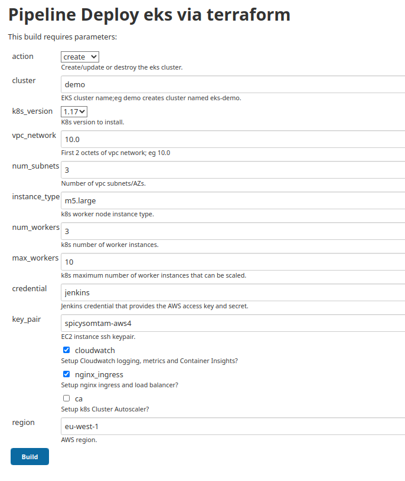

# Introduction

Deploy AWS EKS via a Jenkins job using terraform. The idea here is to easily deploy EKS to AWS, specifying some settings via pipeline parameters.

Why not use `eksctl`? This repo predates `eksctl` and AWS support for it. I might create an `eksctl` based deployment as it saves alot of development effort compared to `terraform`. Tis the nature of technology: nothing stays the same and something better may come along! A good devops practice: use whatever is easiest! If I was to do this again I would probably use `eksctl`.

EC2 instances are used as EKS workers via a node group.

Fargate is not supported in this repo. I test Fargate and its really slow to spin up a pod (~ 60s) and its not very elegant; a Fargate worker node is deployed for each pod since Fargate uses some of virtual machine. See [this issue](https://github.com/aws/containers-roadmap/issues/649) for a discussion on EKS Fargate slowness. At the time of writing this Fargate is not a realistic option (although it may get better in time). My recommendation: stick with EC2 worker nodes.

This is based on the [eks-getting-started](https://github.com/terraform-providers/terraform-provider-aws/tree/master/examples/eks-getting-started) example in the terraform-provider-aws github repo.

Terraform docs are [here](https://www.terraform.io/docs/providers/aws/guides/eks-getting-started.html).

AWS docs on EKS are [here](https://docs.aws.amazon.com/eks/latest/userguide/what-is-eks.html).

# Changes made to the aws provider example

Some changes to the aws provider example:

* Alot of the settings have been moved to terraform variables, so we can pass them from Jenkins parameters:
  + aws_region: you specify the region to deploy to (default `eu-west-1`).
  + cluster-name: see below (default `demo`).
  + vpc-network: network part of the vpc; you can have different networks for each of your vpc eks clusters (default `10.0.x.x`).
  + vpc-subnets: number of subnets/az's (default 3).
  + inst-type: Type of instance to deploy as the worker nodes (default `m4.large`).
  + num-workers: Number of workers to deploy (default `3`).
* The cluster name has been changed from `terraform-eks-demo` to `eks-<your-name>`; this means multiple eks instances can be deployed, using different names, from the same Jenkins pipeline. There does not seem any point in including `terraform` (or even `tf`) in the naming; how its deployed is irrevelant IMHO.
* The security group providing access to the k8s api has been adapted to allow you to pass cidr addresses to it, so you can customise how it can be accessed. The provider example got your public ip from `http://ipv4.icanhazip.com/`; you are welcome to continue using this!

# Jenkins pipeline

Jenkins needs the following linux commands, which can either be installed via the Linux package manager or in the case of `terraform`, downloaded: 
* terraform (0.12.x)
* jq
* kubectl

You will need some aws credentials adding to Jenkins to allow terraform to access your aws account and deploy the stack.

Add the git repo where the code is, and tell it to run [Jenkinsfile](Jenkinsfile) as the pipeline.

`create` creates an eks cluster stack and `destroy` destroys it.

When running the Jenkins job, you will need to confirm the `create` or `destroy`.

You can create multiple eks clusters/stacks by simply specifying a different cluster name.

If a `create` goes wrong (`terraform apply`), simply re-run it for the same cluster name, but choose `destroy`, which will do a `terraform destroy` and clean it down. Conversly you do the `destroy` when you want to tear down the stack.

The pipeline uses a terraform workspace for each cluster name, so you should be safe deploying multiple clusters via the same Jenkins job. Obviously state is maintained in the Jenkins job workspace (see To do below).

.

# IAM roles required

Several roles are required, which is confusing. Thus decided to document these in simple terms.

Since EKS manages the kubernetes backplane and infrastructure, there are no masters in EKS. When you enter `kubectl get nodes` you will just see the worker nodes that are either implemented via autoscaling groups (old method) or via node groups (new in EKS 1.14). With other kubernetes platforms, this command will also show Master nodes. Note that as well as using node groups, you can now use fargate, which also shows up as worker nodes via the `kubectl get nodes` command.

I am just going to discuss those required with kubernetes 1.17 EKS. 

Required roles:
* Cluster service role: this is associated with the cluster (and its creation). This allow the Kubernetes control plane to manage AWS resources on behalf of the cluster. The policy `AmazonEKSClusterPolicy` has all the required permissions, so best use that (unless you require a custom setup). The service `eks.amazonaws.com` needs to be able to assume this role (trust relationship). We also attach policy `AmazonEKSVPCResourceController` to the role, to allow security groups for pods (a new eks 1.17 feature; see [this](https://docs.aws.amazon.com/eks/latest/userguide/security-groups-for-pods.html) for details).
* Node worker or specifically node group role: This allows worker nodes to be created for the cluster via an auto scaling group (ASG). The more modern node group replaces the older method of having to create all the resources manually in AWS (ASG, launch configuration, etc). There are three policies that are typically used (interestingly these have not changed since node groups were introduced):
  * AmazonEKSWorkerNodePolicy
  * AmazonEKS_CNI_Policy
  * AmazonEC2ContainerRegistryReadOnly

It appears the `aws-auth` configmap being inplace allows nodes to be added to the cluster automatically.

# Kubernetes version can be specified

I recently added this. You can choose all the versions offered in the AWS console.

Note that while v1.18 is available for eks, v1.17 is still the default, probably because the k8s Cluster Autoscaler is not available yet for v1.18.

# Automatic setting up of CloudWatch logging, metrics and Container Insights

EKS allows all k8s logging to be sent to CloudWatch logs, which is really useful for investigating issues. In addition, CloudWatch metrics are also gathered from EKS clusters, and these are fed into the recently released Container Insights, which allows you to see graphs on performance, etc. These are not setup automatically in EKS and thus I added this as an option, with the default being enabled (why would you not want this?).

# Kubernetes Cluster Autoscaler install

I added this as an option (default not enabled). What is it? The kubernetes [Cluster Autoscaler](https://github.com/kubernetes/autoscaler/tree/master/cluster-autoscaler) (CA) allows k8s to scale worker nodes up and down, dependant on load. Since EKS implements worker nodes via node groups and the autoscaling groups (ASG), a deployment within the cluster monitors pod load, and scales up nodes via the ASG when pods are not scheduled (not enough resources available to run them), and scales nodes down again when they are not used (typically after 10 minutes of idle).

Note that there is a max_workers Jenkins parameter; ensure this is large enough as this is the limit that CA can scale to!

Also be aware that the minimum number of nodes will be the same as the desired (num_workers Jenkins parameter). Originally I set the minimum to 1 but the CA will scale down to this with no load which I don't think is a good idea; thus I set the minimum to be the same as desired. You don't want low fault tolerance (one worker) or your cluster to be starved of resources. At a minimum you should have 3 workers, if only to spread them across 3 availability zones, provide some decent capacity and ability to handle some load without waiting for CA to scale more nodes.

Note that you should also consider the Horizontal Pod Autoscaler, which will scale pods up/down based on cpu load (it requires `metrics-server` to aquire metrics to determine load).

## Testing the Cluster Autoscaler

The easiest way to do this is deploy a cluster with a limited number of worker nodes, and then overload them with pods. A simple way to do this is deploy a helm3 chart, and then scale up the number of replicas (pods). 

I found that based on a `m5.large` instance type, using a `nginx` deployment, I could deploy approx 30 pods per worker. Lets run through this:

```
$ kubectl get nodes # We only have one node as I deliberatly set the cluster up like this
NAME                                      STATUS     ROLES    AGE   VERSION
ip-10-0-1-74.eu-west-1.compute.internal   Ready      <none>   46m   v1.17.11-eks-cfdc40

$ kubectl -n kube-system logs -f deployment.apps/cluster-autoscaler # we can check ca logging
$ helm create foobah # This creates a local chart based on nginx
$ helm upgrade --install fb0 foobah/ --set replicaCount=30 # 1 node overloaded
$ helm upgrade --install fb0 foobah/ --set replicaCount=60 # 2 nodes overloaded
$ kubeclt get pos -A # Do we have any pending pods?
$ kubectl get nodes # See if we are sclaing up; could check the AWS EC2 Console?
```

## Working round the delay in spinning up another worker

You might ask how can be get round the delay in scaling up another worker? Pods have a priority. You could create a deployment with pods of a lower priority than your default (0); lets call these placeholder pods. Then k8s will kill these placeholder pods and replace them with your regular pods when needed. So you could autoprovision a single node full of these placeholder pods. Your placeholder pods will then become pending after being killed and CA will then spin up another worker for them; since these placeholder pods arn't doing anything useful we don't mind the delay. This is just an idea; I probably need to google a solution where this has been implemented, and provide a link to it (I am sure someone has written something for this).

Another solution: use fargate. I will get round to trying this out. Fargate implements virtual kubelet (the agent on worker nodes); however I am not sure how clever it is in terms providing an infinit resource!

# Accessing the cluster

Ensure your awscli is up to date as the newer way to access the cluster is via the `aws` cli rather than the `aws-iam-authenticator`, which you used to need to download and install in your path somewhere. 

You would use `kubectl` to access the cluster (install latest or >= v1.17 at the time of this update). 

You also need a KUBECONFIG. Using the AWS credentials used by Jenkins to create the cluster (otherwise known as cluster creator access), enter the following to generate a KUBECONFIG:

```
$ aws eks update-kubeconfig --name eks-demo --region eu-west-1
```

Once you can access the cluster via `kubectl get all -A`, you can add access for other aws users; see official EKS docs [here](https://docs.aws.amazon.com/eks/latest/userguide/add-user-role.html). 

# Kubernetes api and worker nodes are on the public internet

Just something to be aware of. My view on this is its not very secure, even though all traffic is encypted using TLS and ports are limited. Ideally these should only be accessible on the vpc, and then you need to get access to the vpc via a bastion host or vpn. However this example is intended to be a simple example you can spin up, and maybe enhance to fit your needs.

# To do

I tried to keep it simple as its a proof of concept/example. It probably needs these enhancements:

## Store terraform state in an s3 bucket

This the recommended method, as keeping the stack in the workspace of the Jenkins job is a bad idea! See terraform docs for this. You can probably add a Jenkins parameter for the bucket name, and get the Jenkins job to construct the config for the state before running terraform.

## Implement locking for terraform state using dynamodb

Similar to state, this ensure multiple runs of terraform cannot happen. See terraform docs for this. Again you might wish to get the dynamodb table name as a Jenkins parameter.